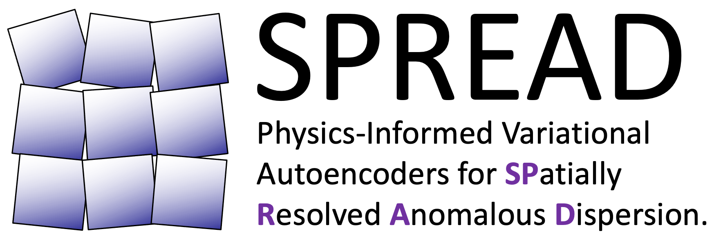
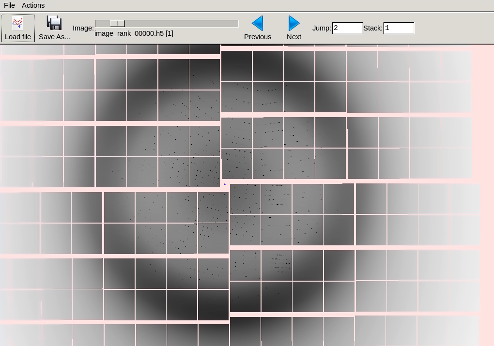
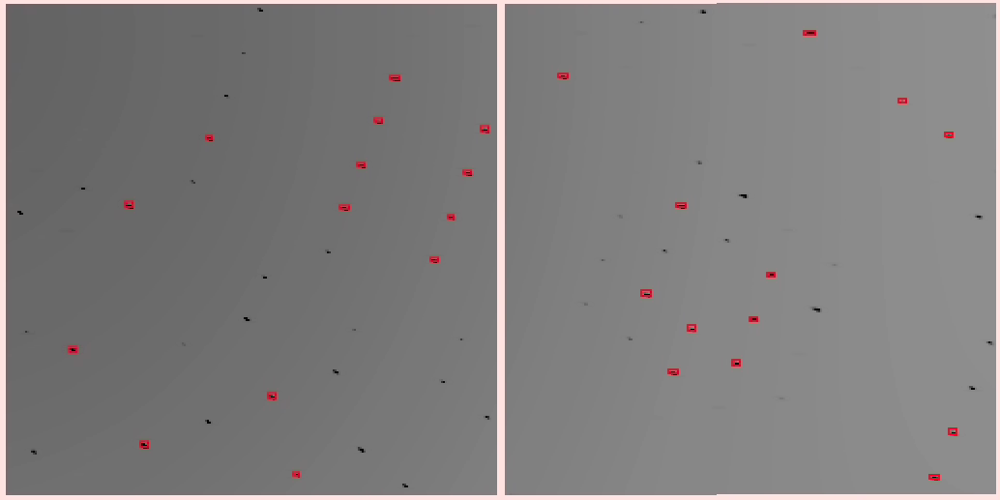
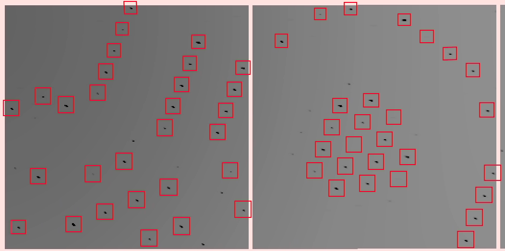

<br/>
<p align="center"></p>

----


# Self-Supervised Deep Learning for Model Correction in the Computational Crystallography Toolbox

## Overview

The [Computational Crystallography Toolbox](https://github.com/cctbx/cctbx_project) (`cctbx`) is open-source software that allows for processing of crystallographic data, including from serial femtosecond crystallography (SFX), for macromolecular structure determination. We aim to use the modules in `cctbx` to determine the oxidation state of individual metal atoms in a macromolecule. Changes in oxidation state are reflected in small shifts of the atom's X-ray absorption edge. These energy shifts can be extracted from the diffraction images recorded in serial femtosecond crystallography, given knowledge of a forward physics model. However, as the diffraction changes only slightly due to the absorption edge shift, inaccuracies in the forward physics model make it extremely challenging to observe the oxidation state.  In this work, we describe the potential impact of using self-supervised deep learning to correct the scientific model in `cctbx` and provide uncertainty quantification. We provide code for forward model simulation and data analysis, built from `cctbx` modules, in this GitHub repository, which can be integrated with machine learning. We describe open questions in algorithm development to help spur advances through dialog between crystallographers and machine learning researchers. New methods could help elucidate charge transfer processes in many reactions, including key events in photosynthesis. 

Please see our full paper [here](https://arxiv.org/abs/2307.01901), presented at the 1st Workshop on Synergy of Scientific and Machine Learning Modeling, International Conference on Machine Learning (ICML) 2023.

## Table of Contents

1. [NERSC Accounts](#nersc)
2. [Installation](#install)
3. [Forward Model](#forward)
4. [Conventional Processing](#processing)
5. [Further Processing](#further)
6. [Citation](#citation)

## NERSC Accounts <a name="nersc"></a>

We highly recommend using the [National Energy Research Scientific Computing Center (NERSC)](https://www.nersc.gov) to run this code. The codes are optimized to run on [Perlmutter](https://docs.nersc.gov/systems/perlmutter/architecture/). To run code on NERSC, you need a [user account](https://docs.nersc.gov/accounts/#obtaining-an-account) and an [allocation](https://www.nersc.gov/users/accounts/allocations/). New users can apply for an [Exploratory Allocation](https://www.nersc.gov/users/accounts/allocations/first-allocation/) of 100 GPU node hours (a GPU node on Perlmutter has 1 CPU + 4 GPUs).

## Installation <a name="install"></a>

To install required modules on Perlmutter please use these [instructions](INSTALL.md).

## Forward Model <a name="forward"></a>

In an SFX experiment, a microcrystal is imaged with an X-ray pulse. The crystal diffracts the X-ray radiation right before it is destroyed. The resulting diffraction image is known as a "still shot." The known forward physics of an SFX experiment on photosystem II can be modeled, resulting in simulated diffraction images. To create a dataset of 100,000 still shots, run the following on a Perlmutter terminal:

```
cd $WORK
mkdir output_spread
cd output_spread
sbatch -A $NERSC_GPU_ALLOCATION $MODULES/SPREAD/scripts/create_images.sh
```

The output is saved in the `$SCRATCH` directory; to list the output files:

```
cd $SCRATCH/psii_sim/images
ls
```

Each `*.h5` container stores multiple simulated images. To visualize a file:

```
dials.image_viewer image_rank_00000.h5
```

An example image:

<p align="center"></p>

A single still shot with low resolution can be created in an interactive session to test functionality:
```
cd $WORK/output_spread
salloc -N 1 --time=60 -C gpu -A $NERSC_GPU_ALLOCATION --qos=interactive --ntasks-per-gpu=8 --cpus-per-task=2
. $MODULES/SPREAD/scripts/interactive_create_image.sh
```
The resulting `*.h5` file is saved in `$SCRATCH/psii_sim/interactive` and can be visualized as above with `dials.image_viewer`.

## Conventional Processing <a name="processing"></a>

The [Diffraction Integration for Advanced Light Sources](https://github.com/dials/dials) (`dials`) processes crystallographic data to identify diffraction spots, determine orientation and unit cell, and determine structure factor amplitudes. For SFX processing, the software `dials` first performs indexing: the strong diffraction spots are identified to determine orientation (i. e. rotation) and unit cell. The next step is integration: the orientation is used to determine where a spot of a certain Miller index should be, and a shoebox is drawn over that spot. The value of the shoebox foreground is integrated. Both the shoebox pixel intensities and the integrated spot value can be used in further processing. To run indexing and integrating, run in a Perlmutter terminal: 

```
cd $WORK/output_spread
sbatch -A $NERSC_CPU_ALLOCATION $MODULES/SPREAD/scripts/indexing_integration.sh
```

Results are saved in $SCRATCH/psii_sim/dials_processing.
To view the results of indexing on an example still shot:

```
cd $SCRATCH/psii_sim/dials_processing
dials.image_viewer idx-image_rank_00000_00000_indexed.refl idx-image_rank_00000_00000_refined.expt
```

An example image from indexing; shoeboxes are drawn around the strong spots:

<p align="center"></p>

To view the results of integration:

```
cd $SCRATCH/psii_sim/dials_processing
dials.image_viewer idx-image_rank_00000_00000_integrated.*
```

An example image from integration; larger shoeboxes are drawn where spots should be:
<p align="center"></p>


## Further Processing <a name="further"></a>

The diffraction spot shoeboxes generated by `dials` can be used in further machine learning pipelines. By demonstrating the known forward physics and conventional methods of indexing and integration, we aim to spark discussion amongst machine learning researchers and crystallographers to create improved processing methods for SPREAD. We outline promising directions in our [paper](PAPER.pdf), please get in touch if you would like to discuss further!

## Citation <a name="citation"></a>

If you find the paper or this repository useful for your work, we would appreciate it if you would cite:

```
@misc{ganapati2023selfsupervised,
      title={Self-Supervised Deep Learning for Model Correction in the Computational Crystallography Toolbox}, 
      author={Vidya Ganapati and Daniel Tchon and Aaron S. Brewster and Nicholas K. Sauter},
      year={2023},
      eprint={2307.01901},
      archivePrefix={arXiv},
      primaryClass={physics.bio-ph}
}
```